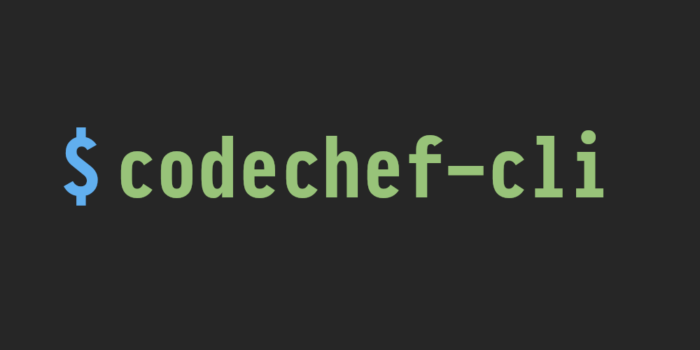

Created as a part of codechef API hackathon.

## Extras

- New codechef friends functionlity. ([codechef-friends](https://github.com/Mrigank11/codechef_friends))
- Neovim plugin. ([codechef.nvim](https://github.com/vn-ki/codechef.nvim))

## Features

- Submit from terminal (using a hack).
- See competetions.
- See ranklist of past competetions. 
- View problems using a tui.
- Add friends and see their profiles.

## Installing

```bash
# Clone the repo
git clone https://github.com/vn-ki/codechef-cli.git
cd codechef-cli

# Install the package
pip install -e .
```

NOTE: Tested only on linux. The tool should work on windows but color support and tui is not guarenteed to work.

## Usage

```bash
$ codechef --help
```

## TODO

- [ ] Integration with codechef friends.
- [ ] Codechef TODO
- [ ] Problem recommendation.
