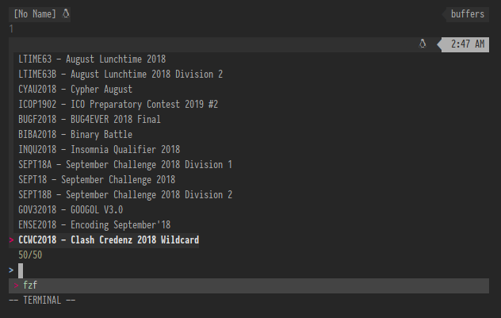
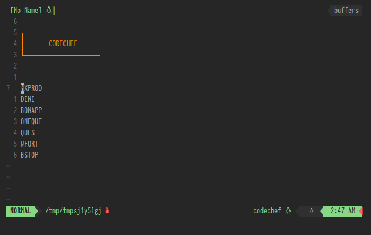
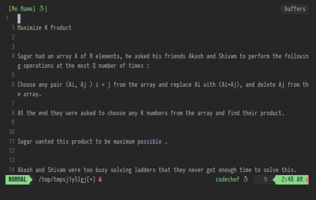
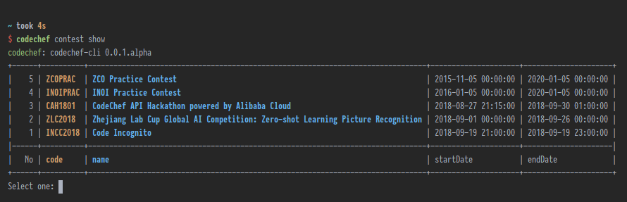
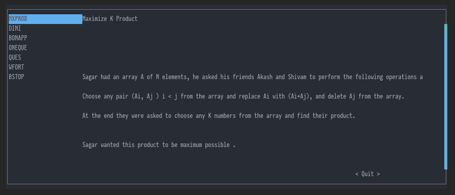
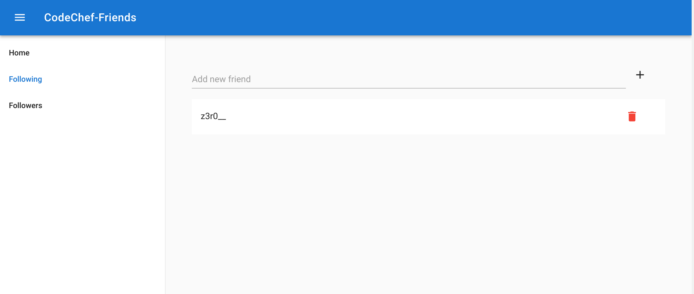
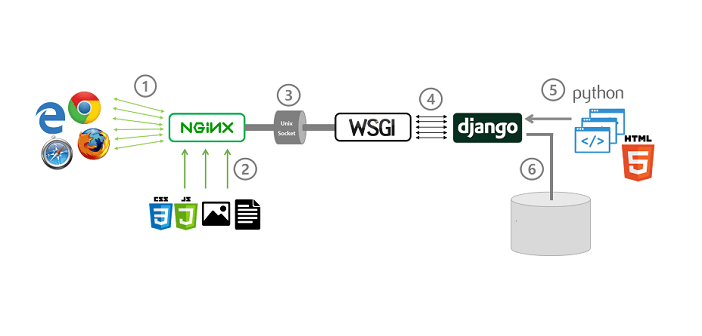

export { future as theme } from 'mdx-deck/themes'

import Box from 'superbox'

<Box bg='#61afef' color='#262626' fontSize={[50, 70, 70, 90]} p={4}>
  codechef-cli
</Box>
<Box bg='#262626' color='#61afef' fontSize={[50, 70, 70, 90]} p={4}>
codechef.nvim
</Box>
<Box p={3}>
Vishnunarayan K I | Mrigank Krishan
</Box>
---

# Why a CLI?

---

Most people prefer to use an ide

and a terminal for their coding works.

---

Not just that we also have a

vim plugin

---

## Features (CLI):
- View contests
- View problems in a very nice cross platform tui.
- View ranklist.
- Submit solutions to problems and view results.
- And much more...

---

## Usage and documentation

Visit: codechef-cli.rtfd.io

---
## Architecture
- Lazy loaded commands
- Easily extendable
- Easily testable (all though lacking code coverage as of now)
---

## vim pictures - contests

---
## vim pictures - contests

---
## vim pictures - contests

---
## cli pictures - contest selection

---
## tui picture - problems

---
#### It's not over, we have more!
<Box bg='#262626' color='#61afef' fontSize={[50, 70, 70, 90]} p={4}>
Codechef-Friends
</Box>

###### Because it's always better with friends!
---

---
- SPA with Material Design.
- Follow friends.
- See who's following you.
- See what your friends are solving.

Visit: aliyun.mrigankkrishan.tk
---
Alibaba Services used:
- ECS: to host the website.
- RDS: to host the MySQL DB.
---
NGINX does the heavy work.

---
## Difficulties
- Learn OAuth2 flow.
- Learn and use click.
- Document using readthedocs and sphinx.
---
# Thank You
